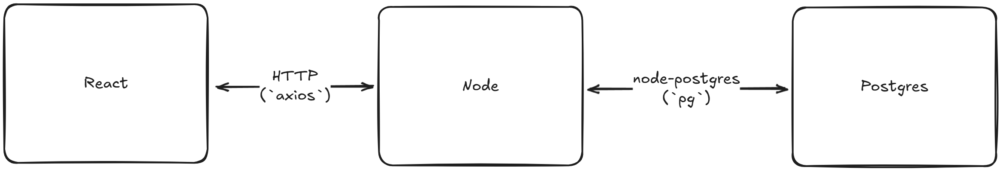

(pt-BR)
# Desafio Backend -  Conveniar
Backend desenvolvido para cumprir com o desafio de desenvolvimento proposto. 

## Introdução
##### Cenário
As Fundações de Apoio são instituições privadas, sem fins lucrativos, que visam dar suporte a projetos de pesquisa, ensino, extensão e de desenvolvimento institucional, científico e tecnológico para as instituições que ela apoia. Geralmente estas instituições são IFES (Instituições Federais de Ensino Superior).

##### Desafio
Crie um formulário para cadastro destas Fundações de Apoio. O formulário deve conter os campos para a fundação inserir o seu nome, CNPJ, e-mail, telefone e a instituição que ela apoia. Uma mensagem deverá ser exibida caso o cadastro seja efetuado com sucesso.
Deve também ser possível pesquisar os registros existentes através do número do CNPJ. Caso a pesquisa encontre resultados, os dados da fundação deverão ser exibidos. Caso o registro não seja encontrado, exibir a mensagem “Fundação não encontrada”.

##### Regras
• O backend da aplicação deve ser escrito em Node.js, PHP ou C#;  
• O código deve ser escrito com o paradigma da programação orientada a objetos;  
• Você não pode utilizar nenhum framework;  
• Você pode usar qualquer outra biblioteca de terceiros que desejar;  
• Crie uma interface minimamente amigável e agradável;  
• O formulário deverá ter as operações de cadastro, consulta, alteração e exclusão de fundações;  
• O formulário não deve permitir o cadastro de mais de uma fundação com o mesmo CNPJ.  


## Solução Proposta
<INTRODUCTION GOES HERE>
The model used is presented in the image below:
<!--  <UPDATE THIS IMAGE WITH NEWER REFERENCES> -->

##### Backend

##### Frontend

##### Database/Containerization


## How to run
##### Step 1 - Clonar o repositório
```git clone git@github.com:RafaelSL-37/desafio-conveniar.git```

##### Step 2 - Construir o docker
```docker-compose up --build```

##### Step 3 - Abrir a aplicação
Abra o arquivo `index.html` que está dentro da pasta `frontend` no seu navegador.

-------------------------------------------------------------------------------------------------------------------------------

(en-US)
# Backend Challenge -  Conveniar
Backend developed to fullfil the challenge proposed of building a system without using frameworks.

## Introduction
##### Setting
Support Foundations are private, non-profit institutions that aim to support research, teaching, outreach, and institutional, scientific, and technological development projects for the institutions they support. These institutions are typically Federal Higher Education Institutions (IFES).

##### Challenge
Create a form to register these Support Foundations. The form should contain fields for the foundation to enter its name, CNPJ (Brazilian Taxpayer Registry), email, phone number and the institution it supports. A message should be displayed if the registration is successful.
It should also be possible to search existing records using the CNPJ number. If the search results are found, the foundation's data should be displayed. If the record is not found, the message "Foundation not found" should be displayed.

##### Rules
• The application backend must be written in Node.js, PHP, or C#;  
• The code must be written using the object-oriented programming paradigm;  
• You cannot use any framework;  
• You can use any third-party library you wish;  
• Create a minimally user-friendly and pleasant interface;  
• The form must have operations for registering, consulting, modifying, and deleting foundations;  
• The form must not allow the registration of more than one foundation with the same CNPJ (Brazilian Taxpayer Registry).


## Proposed Solution
<INTRODUCTION GOES HERE>
The model used is presented in the image below:
<!--  <UPDATE THIS IMAGE WITH NEWER REFERENCES> -->

##### Backend

##### Frontend

##### Database/Containerization


## How to run
##### Step 1 - Clone Repository
```git clone git@github.com:RafaelSL-37/desafio-conveniar.git```

##### Step 2 - Build Docker
```docker-compose up --build```

##### Step 3 - Run the application
Just open the `index.html` file inside the `frontend` folder on your web browser.